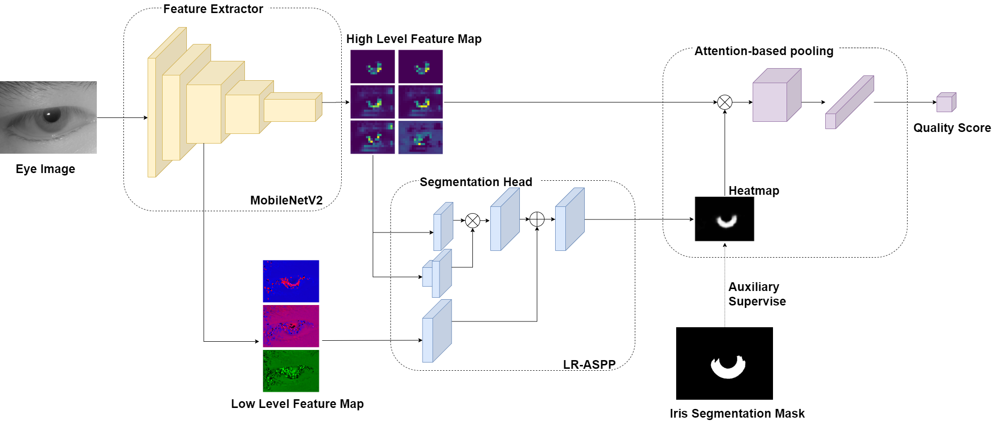

# Recognition Oriented Iris Image Quality Assessment in the Feature Space



[Paper](https://arxiv.org/abs/2009.00294)   [Dataset](http://www.cripacsir.cn/dataset/casia-iris-complex/)

## Prerequisites

python 3

pytorch 1.0+

torchvision 0.2+

opencv 3.4

scipy

thop

## Citing

If DFSNet is useful for your research, please consider citing:

```bibtex
@InProceedings{wang-ijcb2020,
  author    = {Leyuan, Wang and Kunbo, Zhang and Min, Ren and Yunlong, Wang and Zhenan, Sun},
  title     = {Recognition Oriented Iris Image Quality Assessment in the Feature Space},
  booktitle = {International Joint Conference on Biometrics 2020 (IJCB2020)},
  year      = {2020}}
}
```
